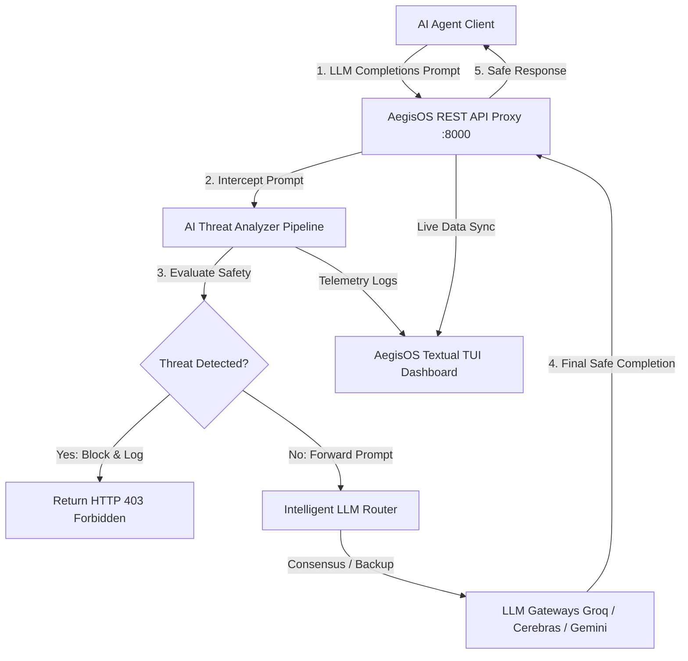

# 🛡️ AegisOS — Real-Time AI Agent Security Shield & Router Consensus

[](https://www.python.org/)
[](https://fastapi.tiangolo.com/)
[](https://textual.textualize.io/)

**AegisOS** is a state-of-the-art, real-time security middleware and intelligent routing layer designed as an **immune system for autonomous AI Agents**. AegisOS acts as an intercepting proxy between your AI agents and LLM providers. It monitors all prompts for malicious intent, executes parallel multi-LLM consensus checks, enforces emergency sanitization, and dynamically manages active gateways via a premium terminal TUI dashboard.

---

## 🌟 Key Highlights & Modern Capabilities

- 🛡️ **Real-time Threat Interception & Sanitization**: Operates as an inline HTTP proxy, screening agent prompts for **Jailbreaks, Prompt Injections, Memory Poisoning, Tool Abuse, SSRF, Sandbox Escapes, and Data Exfiltration** before they hit downstream LLM models.
- ⚙️ **Dynamic TUI API Keys Management (`8 - KEYS`)**: Register, modify, and test API keys (Groq, Cerebras, Google Gemini) directly within a gorgeous visual portal in real-time.
- 🔄 **Dynamic Model Configuration & Hot-Reload (`9 - MODEL CFG`)**: Switch active provider models on-the-fly from the TUI! Dynamic sync persists configurations straight to your local `.env` and immediately reinstantiates the underlying router, analyzer, and consensus engines without restarting the application!
- 🤝 **Multi-LLM Consensus Routing**: Protects systems by distributing classification tasks across priority chains, implementing automatic load-balancing and smart model fallbacks depending on your chosen routing strategy.
- ⚡ **Highly Scalable Routing Modes**:
  - `BALANCED`: Balances API token cost, execution speed, and detection accuracy.
  - `CHEAPEST`: Prioritizes Groq & Cerebras open-weights models to minimize cost.
  - `FASTEST`: Routes prompt packets to the fastest responding gateway.
  - `SMARTEST`: Directs critical scans to Google Gemini's advanced reasoning nodes.
- 🔌 **Dynamic Live / Mock Fallbacks**: Automatically connects to the live AegisOS Proxy Server. If the proxy server is offline, it gracefully falls back to a high-fidelity local `MockEngine` running 6 pre-configured agents and realistic random-walk telemetry.
- 🧪 **Interactive Security Sandbox (`6 - SANDBOX`)**: Submit custom exploit prompts or load preset test suites (Jailbreak, Injection, Tool Abuse) to watch the AegisOS immune system classify threats, output mitigation vectors, and log routing hops in real-time.
- 📦 **Single-File Executable (`aegisos.exe`)**: Bundled with all dependencies (FastAPI, Textual, Uvicorn, Rich, etc.) compiled natively into a portable Windows binary for one-click setup!

---

## 🛠️ Architecture & Component Flow



---

## 🚀 Getting Started & Installation

### Prerequisites
- **Python**: Version `3.10` or higher is required.
- **Pip**: Python package manager.

### 1. Installation Modes

Install the framework and its dependencies natively:

```bash
# Clone the repository
git clone https://github.com/yourusername/aegisos.git
cd aegisos

# Full installation (Terminal UI + HTTP Proxy Support)
pip install -e ".[proxy]"
```

*Alternatively, you can run the compiled portable executable located inside the `dist/aegisos.exe` directory.*

### 2. Fast Setup & API Configuration
Copy the environment template and initialize your local settings:

```bash
cp .env.example .env
```

Open `.env` and fill in your keys:
```env
# LLM Provider API Keys (Fill in at least one to get started)
GROQ_API_KEY=your_groq_key_here
CEREBRAS_API_KEY=your_cerebras_key_here
GEMINI_API_KEY=your_gemini_key_here

# Selected Default Models
GROQ_MODEL=llama-3.1-8b-instant
CEREBRAS_MODEL=llama3.1-70b
GEMINI_MODEL=gemini-2.5-flash

# Active Routing Consensus Strategy (balanced, cheapest, fastest, smartest)
AEGIS_ROUTE_MODE=balanced
```

---

## 🎮 How to Run AegisOS

### Mode A: Full-Stack Real-Time Monitoring (Recommended)

1. **Start the AegisOS Proxy Server** in your primary terminal:
   ```bash
   python -m aegisos.engine.proxy_server
   ```
   *(Server starts listening on `http://localhost:8000`)*

2. **Launch the TUI Dashboard** in a second terminal:
   ```bash
   python -m aegisos
   ```
   *(AegisOS automatically detects the proxy server, registers to it, and switches to Live Mode)*

3. **Run the Agent Integration Test Suite**:
   ```bash
   python test_all_agents.py
   ```
   Watch the **Groq**, **Cerebras**, and **Gemini** test bots dynamically register themselves, send prompts, trigger block policies, and populate the dashboard live!

### Mode B: Self-Contained Offline Simulation

If no proxy is running, launch the TUI directly:
```bash
python -m aegisos
```
AegisOS will display: `⚠️ Proxy not available, using mock data`. It will instantly initialize the `MockEngine` with 6 simulated agents, firing automated pattern attacks and graphing live hardware telemetry!

---

## ⌨️ TUI Keyboard Shortcuts & Map

Navigating the AegisOS system is extremely fluid. Press these keys at any time to hop between control consoles:

| Hotkey | Screen Name | Screen Purpose |
|:---:|:---|:---|
| **`1`** | **DASHBOARD** | Full system overview, telemetry gauges, and threat feed. |
| **`2`** | **THREATS** | Deep catalog of all blocked exploit payloads and details. |
| **`3`** | **AGENTS** | Monitor connected agent nodes, roles, and change isolation states. |
| **`4`** | **MODELS** | Monitor active API gateways, latency, and consensus routing log. |
| **`5`** | **TELEMETRY** | Real-time high-fidelity hardware consumption graphs. |
| **`6`** | **SANDBOX** | Live exploit injector playground for custom and preset testing. |
| **`7`** | **LOGS** | Continuous raw system operation and connection logs feed. |
| **`8`** | **KEYS** | Manage, check, and test LLM provider keys directly inside the TUI. |
| **`9`** | **MODEL CFG** | Customize provider models and trigger dynamic hot-reloads on-the-fly. |
| **`?`** | **HELP** | Full keyboard command summary and references card. |
| **`L`** | **LOCKDOWN** | *Emergency global override*—instantly isolate all active agents. |
| **`R`** | **REFRESH** | Refresh current screen data. |
| **`Q` / `ESC`** | **QUIT** | Safely close the TUI session. |

---

## 📂 Project Structure

```
d:\Completed_Side_projects\AegisOS/
├── aegisos/                 # Core Source Package
│   ├── config.py            # Dotenv configuration parser
│   ├── main.py              # Textual TUI entry app
│   ├── __main__.py          # Module launcher
│   ├── engine/              # Operational Engines
│   │   ├── mock.py          # Simulated threat/agent generator
│   │   ├── proxy.py         # Underlying proxy logic & pre-screening
│   │   ├── proxy_server.py  # FastAPI Server endpoints
│   │   ├── proxy_integration.py # Live TUI-to-Proxy sync client
│   │   └── router.py        # Intelligent routing & consensus logic
│   ├── llm/                 # LLM Client Integrations
│   │   ├── base.py          # Abstract provider wrapper
│   │   ├── groq.py          # Groq Llama client
│   │   ├── cerebras.py      # Cerebras fast-inference client
│   │   ├── gemini.py        # Google Gemini client
│   │   └── analyzer.py      # Multi-stage AI threat classifier
│   ├── store/               # Centralized State management
│   │   └── state.py         # Dataclass AppState schema
│   ├── widgets/             # Reusable UI widgets
│   │   ├── nav.py           # Sidebar navigation panel
│   │   ├── header.py        # Metrics header bar
│   │   ├── threat_card.py   # Expandable threat report element
│   │   ├── metrics.py       # High-fidelity system telemetry gauges
│   │   ├── agent_status.py  # Table for monitoring agent nodes
│   │   └── log_viewer.py    # Log terminal visualizer
│   └── screens/             # Dedicated TUI Screens
│       ├── dashboard.py     # Main overview HUD
│       ├── threats.py       # Security alerts log
│       ├── agents.py        # Agent control center
│       ├── models.py        # API gateways & consensus log
│       ├── telemetry.py     # Real-time resource metrics
│       ├── sandbox.py       # Interactive exploit playground
│       ├── logs.py          # Internal logs terminal
│       ├── keys.py          # API Key Management Screen
│       ├── models_config.py # Live Model Configuration & hot-reload Screen
│       └── help.py          # Hotkey references overlay
├── launch_aegisos.py        # Standalone launcher hook
├── aegisos.spec             # PyInstaller specifications
├── dist/                    # Compiled release files
│   └── aegisos.exe          # Portable Windows Application Binary
└── README.md                # This Master-Class Project README
```

---

## 🧪 Comprehensive Verification & Tests

We provide built-in unit and integration test scripts to verify all aspects of the pipeline:

- **Verification of Imports & Handlers**:
  ```bash
  python test_imports.py
  ```
  *(Verifies all UI layouts, widgets, engines, and state schemas compile successfully)*
- **End-to-End Live Integration Tests**:
  ```bash
  python test_all_agents.py
  ```
  *(Sends mock safe and malicious prompts to port 8000, confirming that AegisOS detects and blocks exploits accurately while logging routing hops!)*

---

## 📄 License
AegisOS is open-source software licensed under the **MIT License**.

---

**AegisOS** — *Empowering Autonomous Agents with a Robust, Self-Defending immune system.*  
Made with ❤️ for developers.
